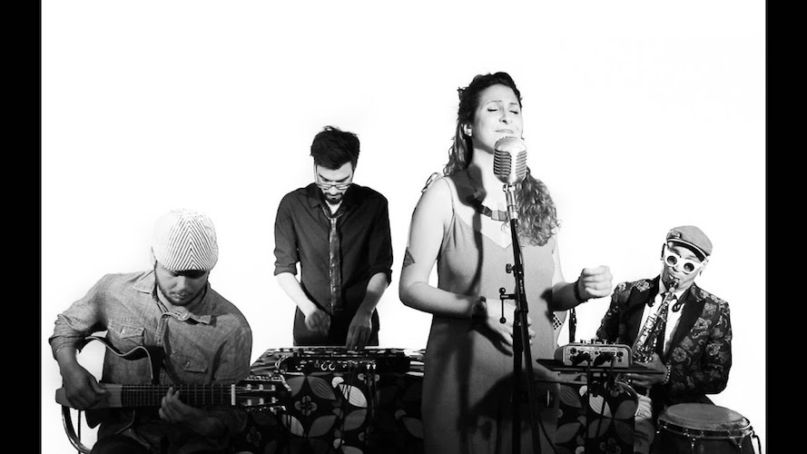
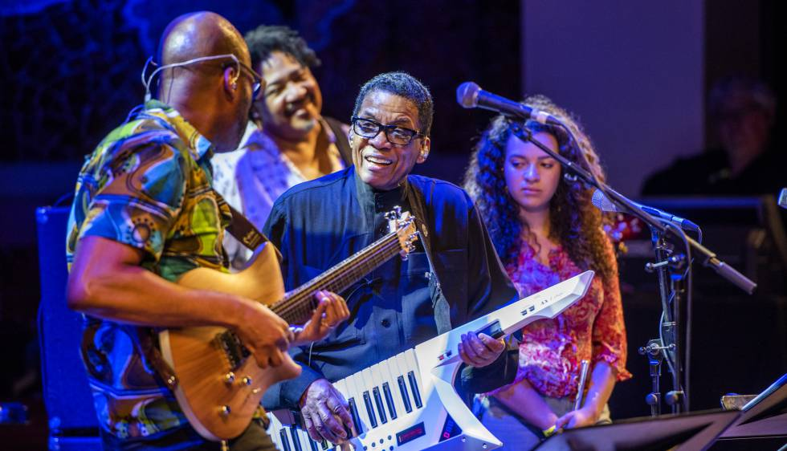

After many years of practising the piano and the bass guitar in music bands, particularly playing versions of soul and funk music, I discovered the world of Brazilian music a few years back. I opened a tiny door that had remained closed until then and I discovered a whole musical universe. 

Where to start from? Maybe with a pioneer and essential album released in 1959 that defined the principles of a brand new music style at the time called bossa nova: Chega de Saudade by João Gilberto. Remarkable by the beauty of its melodies and the sobriety of João's interpretation, it is often considered as the first bossa nova album. Co-authored by Antônio Carlos Jobim, Vinícius de Moraes, Ary Barroso and many more, it features beautiful tracks like "Chega de Saudade", "Desafinado", "Hó-Bá-Lá-Lá"", "Bim-Bom" and "Brigas, Nunca Mais".

Another masterpiece of Bossa Nova is the soundtrack of the movie Orfeo Negro released in 1959 and primed with La Palme d'Or at the 1959 Cannes Film Festival. It is based on the play Orpheu da Conceição by Vinícius de Moraes, itself an adaptation of the Greek legend of Orpheus and Eurydice, set in the modern context of a favela in Rio de Janeiro during Carnaval. The soundtrack was created by Antônio Carlos Jobim, whose song "A Felicidade" opens the film; and Luiz Bonfá, whose "Manhã de Carnaval" and "Samba de Orfeu" have become classics of bossa nova.

<figure>
  <figcaption>Gamellan performance, open air, 3rd order Ambisonics:</figcaption>
  <audio controls src="/sounds/gamellan.mp3">
    Your browser does not support the <code>audio</code> element.
  </audio>
</figure>

<figure>
  <figcaption>Sofree live @ Sinestesia, Barcelona:</figcaption>
  <audio controls src="/sounds/sofree.mp3">
    Your browser does not support the <code>audio</code> element.
  </audio>
</figure>

<figure>
  <figcaption>Herbie Hancock live @ Palau de la Musica Catalana, Barcelona:</figcaption>
  <audio controls src="/sounds/herbie.mp3">
    Your browser does not support the <code>audio</code> element.
  </audio>
</figure>

<figure>
  <figcaption>Richard Bona & Alfredo Rodríguez @ Barts, Barcelona:</figcaption>
  <audio controls src="/sounds/sofree.mp3">
    Your browser does not support the <code>audio</code> element.
  </audio>
</figure>

<figure>
  <figcaption>Christmas concert, El Orfeó Català @ Plaça del Rei, Barcelona:</figcaption>
  <audio controls src="/sounds/orfeo.mp3">
    Your browser does not support the <code>audio</code> element.
  </audio>
</figure>
