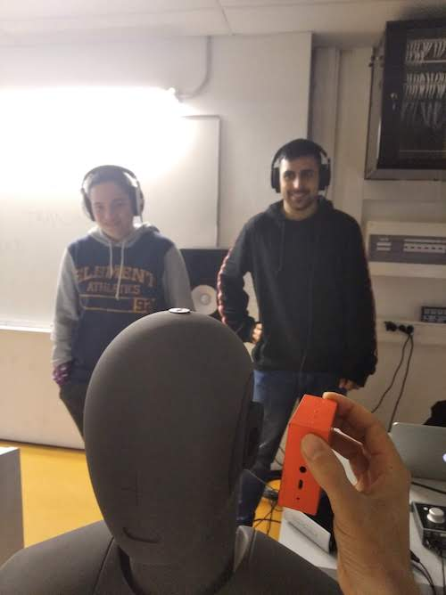

When I was proposed a few months ago to teach acoustics in [ENTI-UB](https://enti.cat/en/course/degree-music-sound-production/) (School of New Interactive Technologies), I first thought of my favourite teachers when I was myself studying. I've always had the feeling that these teachers largely contributed to my present career by transmitting me their knowledge and curiosity regarding some scientific topics.

## Can I really organise my knowledge and construct a course out of it?

Along my work experience, I have built my own grasp of the science of Acoustics in many different branches, but where to start from when it comes to teach this subject to some people with no prior experience?

Fortunately, the Universidad de Barcelona decrees a list of notions that have to be taught to the students, besides the fact that a colleague of mine was already teaching Acoustics the year before.

After a moment of reflexion I thought that I should find the correct balance between classes of pure physics, which some students may be reluctant to, and classes more fancy and real-life oriented like psychoacoustics, room acoustics and musical acoustics.

And that, in order to stimulate them, should come with the accompanying message: "room acoustics is pretty cool right? it is indeed, but to understand the principles underlying it you have to get your hands dirty. No pain no gain!"

## And what about teaching in Spanish?

This was my biggest fear: how to be confident enough to teach in a language that is not mine? Especially given that I never had class in Spanish? and teaching to young folks who may have never had a foreign teacher?

Again, I thought about some of my teachers who where not french native: this is when I learnt that 1. knowledge is cross-border, 2. like my teacher, I may work myself in a foreign country when I grow up.

This being said, I trained myself pretty hard and asked my Spanish native friends for some tips before giving my first class.

## Okay!

Then came the time to give my first class. Drum roll... As expected, it was uneasy and a bit laborious, but nor was a disaster. Phew! And I did improve over time. Until I noticed that some students were appreciating my classes. Hooray!

Now, I can confirm that I like to teach Acoustics, and that I have sympathy for my students too. There's nothing like the gratitude you can feel when teaching new stuff to students who are willing to learn!

  

