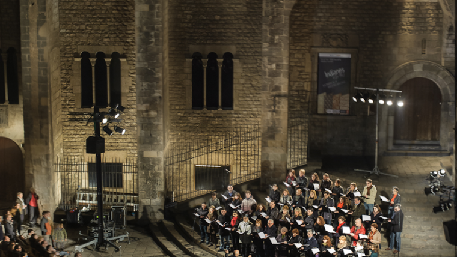

A collection of ambisonic and binaural recordings. Put your headphones on!!!

<figure>
  <figcaption>Gamellan performance @ yard of L'Auditori de Barcelona:</figcaption>
  <audio controls src="/sounds/gamellan.mp3">
    Your browser does not support the <code>audio</code> element.
  </audio>
</figure>

<figure>
  <figcaption>Richard Bona & Alfredo Rodríguez @ Barts, Barcelona:</figcaption>
  <audio controls src="/sounds/bona.mp3">
    Your browser does not support the <code>audio</code> element.
  </audio>
</figure>

<figure>
  <figcaption>Christmas concert, El Orfeó Català @ Plaça del Rei, Barcelona:</figcaption>
  <audio controls src="/sounds/orfeo.mp3">
    Your browser does not support the <code>audio</code> element.
  </audio>
</figure>

<figure>
  <figcaption>Herbie Hancock @ Palau de la Musica Catalana, Barcelona:</figcaption>
  <audio controls src="/sounds/herbie.mp3">
    Your browser does not support the <code>audio</code> element.
  </audio>
</figure>

<figure>
  <figcaption>Sofree @ Sinestesia, Barcelona:</figcaption>
  <audio controls src="/sounds/sofree.mp3">
    Your browser does not support the <code>audio</code> element.
  </audio>
</figure>
