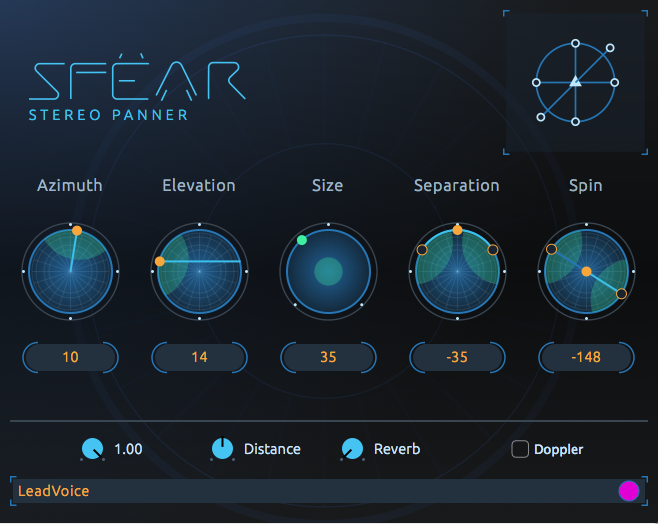

  
  

Sfëar plugins suite is a toolkit allowing for the creation of 3D audio content to be reproduced over any loudspeaker array or headphones whether they support head tracking or not. The plugins suite gathers spatial panners for mono, stereo and multichannel sources, an ambisonic panner meant for ambisonic recordings, a 3D reverberation plugin, a 3D visualizer and an ambisonic player, among other features like an embedded recorder and the support of SOFA offering different flavours to the binaural decoding. The plugins come in different formats supported by main commercial DAWs. 
 
More information about Sfëar plugins can be found [here](http://qrush.space/).  
