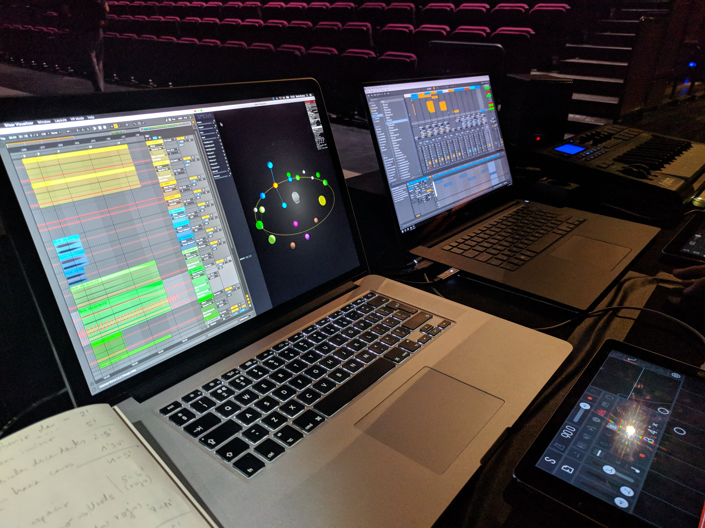
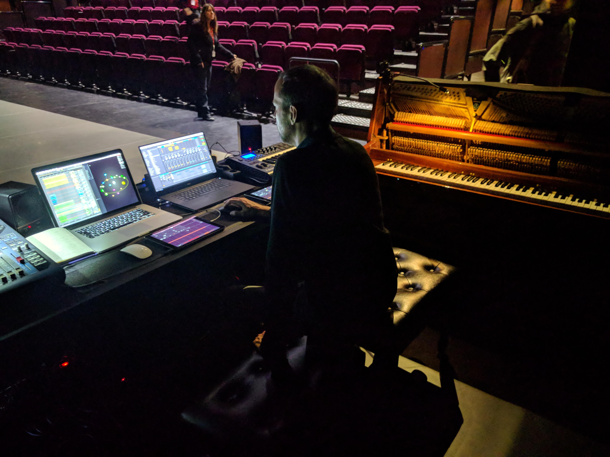
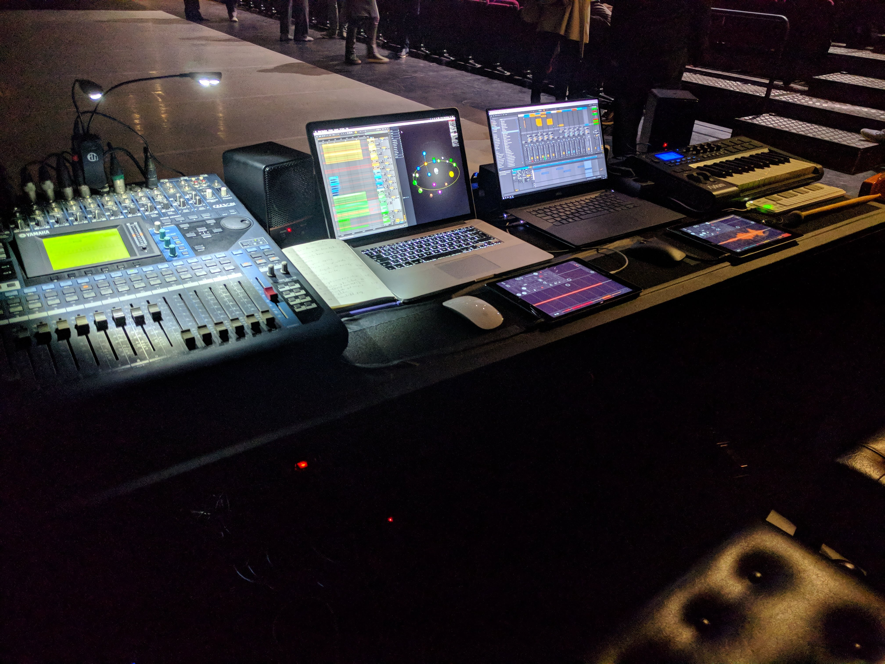

Eurecat collaborated with the Teatre Nacional de Catalunya for '3Dfying' the soundtrack of a contemporary dance performance choreographed by Gelabert Azzopardi Companyia de Dansa and performed during ten consecutive shows. This included the installation and calibration of a 3D loudspeaker layout in the venue and some training course on Sfëar plugins given to the sound engineer. The soundtrack composed by Borja Ramos included scene based content (High Order Ambisonics) created in advance as well as channel based content (direct loudspeaker adressing) created in live by acoustic instruments, thereby offering the audience a thrilling immersive experience.

  
  
  

More information about Nom can be found [here](https://www.tnc.cat/es/nom).  
