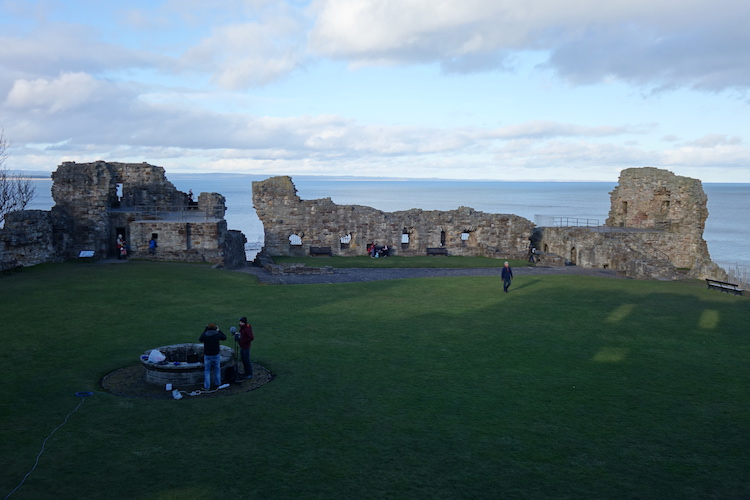
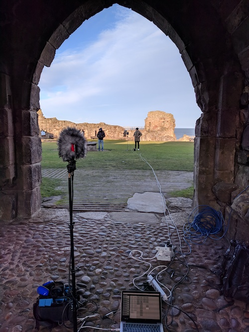
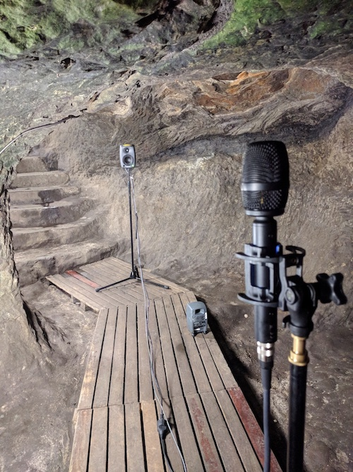
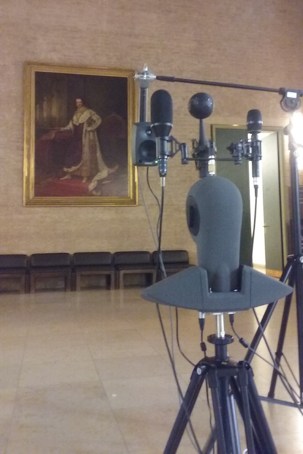
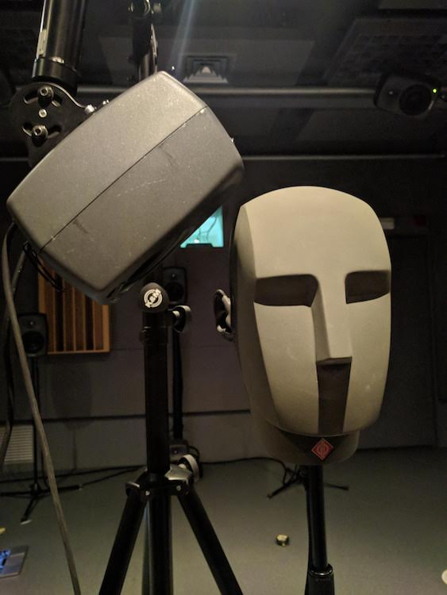
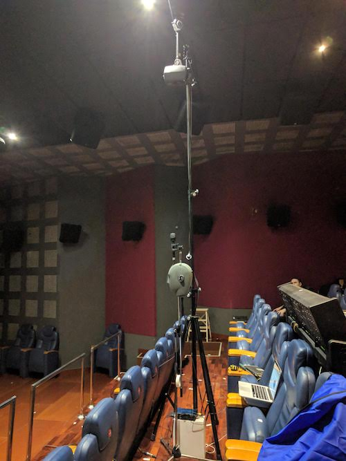
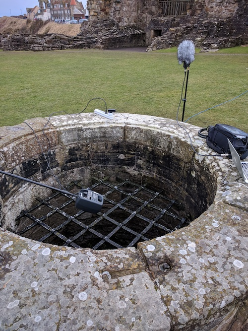

The reverberation of a room is composed of a series of reflexions of the original impulsive sound onto the room boundaries, each having its own time of arrival, direction of arrival, level and spectral content. Partially depending on the source position and listening position, the reverberation pattern of a room is unique and thereby can be seen as its *acoustic signature*. 

The reverberation pattern of a room is retrieved from its impulse response, which can be measured by different well-known techniques. Most of these involve using a loudspeaker for playing back a specific stimulus signal and a microphone for capturing the series of subsequent echoes. The microphone can be of various type among single capsule microphones with a variety of directivity patterns, ambisonic microphones of different orders, or Head And Torso Simulators (HATS). Depending on the type of used microphone, the impulse response is called either Room Impulse Response (RIR), Ambsionic Room Impulse Response (ARIR), Binaural Room Impulse Response (BRIR) or Head Related Room Impulse Response (HRIR) in the case of anechoic conditions. 

Carrying out room impulse response measurements has several fields of application: it may be used for analysing the acoustic characteristics of a room like the reverberation time and the room modes, or it can be used for simulating the acoustics of a desired room in an auralisation process. 

The impulse response measurement campaigns performed in the demonstration sites of BINCI project aimed to auralise the content of the audio guides for an enhanced visitor's experience. The room impulse responses were measured with a 1rst order ambisonic microphone from several listening positions and with several source positions, leading to an authentic cartography of the room reverberation in the spherical harmonics domain. This allowed for a dynamic rendering of the binaural audio content supporting head rotations and with a variety of possible sound source positions within the rooms. 

In Die Alte Pinakotheke, the narrator's voice was processed with the acoustic signature of the rooms to be visited during the tour, thereby creating the illusion of having a virtual guide standing next to oneself. In StAndrews Castle, the story of the most dramatic events in the castle’s history was illustrated by using soundscapes made of typical sounds (main characters voice, screams from the bottle dungeon, kitchen's daily sounds, battle sounds etc.) augmented with the acoustic signature of the corresponding rooms, by then offering a vivid and immersive visiting experience. The benefit of using binaural audio content for audio guides and the underlying methods for capturing the room reverberation and using it for mixing the audio content will be published under the name *Binaural sound for audio guides: an enhanced visitor’s experience in museums and archeological sites* in the session *Archaeology of Soundscapes and Soundscapes for Archaeology* in the [2020 meeting of the European Association of Archaeologists](https://www.e-a-a.org/EAA2020/Programme.aspx?WebsiteKey=4245c0d1-9c0e-4a58-bfa2-906885ad5f28&hkey=e2646dc0-ed23-404c-ad20-24129c9e69c3&Program=3#Program). 

Some demos of the binaural audio guides (head-locked) created for BINCI are available [here](https://www.youtube.com/watch?time_continue=24&v=AfFsXqODqOQ&feature=emb_logo) and [there](https://www.youtube.com/watch?time_continue=165&v=ijhN34Jwkw0&feature=emb_logo). 

The measurement datasets of BINCI were [published in Zenodo](https://zenodo.org/record/1299894#.XSHGfNMzbMU) and subject to a [proposal of a new Convention of SOFA](http://www.aes.org/e-lib/browse.cfm?elib=19560) (Spatially Oriented Format for Acoustics) meant for ambisonic room impulse responses, presented at the 144th AES Convention in Milan in 2018. After the presentation we were suggested by Franz Zotter and Angelo Farina to include ambisonic sources in the proposed SOFA convention, which we have worked on in order to present soon an updated SOFA convention named MultiPerspectiveAmbisonicRoomImpulseResponse (MPARIR), fully supporting ambisonic sources and receivers from/to multiple positions, thereby allowing for an accurate cartography of the reverberation of a room in Ambisonics. MPARIR convention will be discussed in a Standard Committee during the 2020 146th AES Convention.
