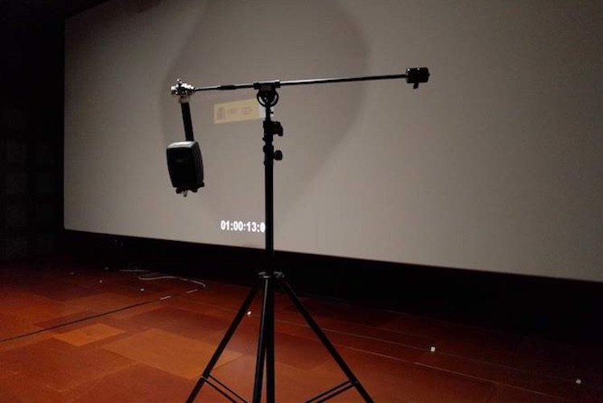

The reverberation of a room is formed of a series of reflexions of the original impulsive sound onto the room boundaries, each having its own time of arrival, direction of arrival, level and spectral content. Partially depending on the source position and listening position, the reverberation pattern of a room is unique and thereby can be seen as its *acoustic signature*. 
The reverberation pattern can be retrieved from the impulse response of the room, that can be measured by different well-known techniques. Most of them involve using a loudspeaker for playing back a specific stimulus signal and a microphone for capturing the series of subsequent echoes. The microphone can be of various type among single capsule microphones with a variety of directivity patterns, Ambisonics microphones of different orders, and Head And Torso Simulators (HATS).

The main outcome of BINCI was the audio content in binaural of the audio guides of 3 cultural sites throughout Europe:
- Die Alte Pinakotheke, Munich, Germany
- La Fundació Miró, Barcelona, Spain
- StAndrews Castle, StAndrews, Scotland

With this objective in mind, a suite of plugins allowing to create head-tracked binaural audio content has been developed in the project, validated by a carefully chosen users group, and provided to audio producers who designed the content of the audio guides. For the storytelling to reach a high level of realism and immersiveness, we gave the producers the possibility to mimic the exact acoustics of the rooms included in the visit of the targeted sites by using their unique reverberation patterns, captured beforehand in Ambisonics. On site, the visitors would be provided with a mobile device embedding an Ambisonic player and a pair of headphones equipped with a headtracker, thereby offering a dynamic and immersive binaural experience. Moreover, a software tool has been developed that allows the visitors to select the HRTFs among an HRTFs database that match best their own physiology for an even increased binaural experience. Opinion polls conducted at the end of the visit clearly showed that the immersive storytelling was well received and even left its mark to most of the visitors. 
More information about BINCI can be found [here](https://binci.eu/).  
Measurement campaigns of Ambisonics Room Impulse Responses were established in all sites mentioned above: some exhibition galleries and halls of Die Alte Pinakotheke and La Fundació Miró, as well as the different spots of StAndrews Castle: entrance porch, guard chambers, kitchen cellars, mine and countermine (underground tunnels), bottle dungeon.  
These measurement datasets were [published in Zenodo](https://zenodo.org/record/1299894#.XSHGfNMzbMU) and subject to a [proposal of a new Convention of SOFA](http://www.aes.org/e-lib/browse.cfm?elib=19560) (Spatially Oriented Format for Acoustics) presented at the 144th AES Convention in Milan, Italy in 2018.
