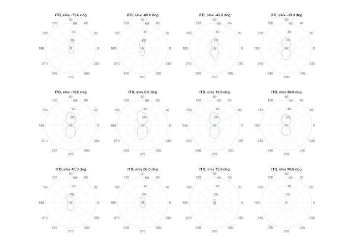

Binaural hearing allows every human being to localise sound sources in its surroundings, from left to right, front and back, up and down. This ability is due to some binaural cues that dictate an incoming direction when processed by our brain. The two main binaural cues for the horizontal plane are the *Interaural Time Difference* (ITD) and the *Interaural Level Difference* (ILD). 

The ITD refers to the timing difference for a sound when reaching our two ears and is mainly effective at low frequencies, whereas the ILD refers to the level difference between our ears and is mainly effective at high frequencies. For example, a sound that reaches the right ear before the left ear was probably emitted by a source located on the right of the subject. If the frequency is high enough, the signal reaching the right ear exhibits a higher level than the signal reaching the left ear due to the shadowing effect of the head. 

However, ILD and ITD are not sufficient to distinguish between a source coming from the front and a source coming from the back, a common issue often referred to as front-back confusion. Nor do they for elevated sources. Instead, monaural cues like spectral content modification allow to tell the difference between the front and the back, as well as between the horizontal plane and an elevated plane. In general a source coming from the back will exhibit less high frequencies than a frontal source because of the low pass filtering provoked by the back part of the outer ear (helix). Head rotational movements can also help in avoid avoiding front-back confusion since the ITD and ILD will change according to the direction of the head rotation and the source position. As for an elevated source, the reflexions onto the shoulders and the skin convolutions of the outer ear (antihelix, tragus, scapha, concha) interfere with the direct sound thereby provoking comb-filtering in the perceived signal. The interference patterns are the main cue in the perception of an elevated source. 

All these spatial cues can be captured by measuring the spatial filters between every position of space and the two ears, called *Head Related Impulse Responses* (HRIRs) when done in anechoic conditions and *Binaural Room Impulse Responses* (BRIRs) when done in a reverberant room. Although several public databases of HRIRs are available for download, either measured with a HATS or with a binaural microphone worn by individuals, at Eurecat we are used to carry out our own HRIRs and BRIRs measurements. With this material at hand we compute binaural decoders following our own method inspired by the most recently published techniques. The binaural decoders are meant for the binaural rendering of the ambisonic content created with Sfëar plugins, be it static (head-locked) or dynamic (head-tracked). Moreover, we use to store these measurement data into SOFA files of type SimpleFreeFieldHRIR, which makes convenient to change the flavour of the binaural rendering. 

A key aspect of these techniques is the ability to detect the ITD of each pair of HRIRs or BRIRs. Contrary to HRIRs, some BRIRs may not exhibit their main peak when the direct sound reaches the ear, but rather when does a strong reflexion after bouncing off a reflective surface of the room. This is often the case in the contra lateral HRIR (opposite ear) with lateral sources. Our technique shows quite good performance in these borderline cases, as shown in the above polar plots. 

Another important aspect of these techniques is the ability to model the ITD as a function of the source position (azimuth, elevation and distance to some extent) and the diameter of the head. At Eurecat we developed a spherical head model showing quite accurate performance as illustrated by the mesh in the above plot (ITD in samples@48kHz, as a function of azimuth and elevation angles, source at 2 meters). 

A last word regarding the near field. In the far field, i.e. beyond about 1 meter, the ILD and ITD are independent of the source distance and depend only on the azimuth and elevation angles. On the contrary, the binaural cues of a source in the near field are distance dependent, in particular the ILD increases dramatically when the source gets closer to the ear, as illustrated in the above plots (at discrete distances on left plot, as a continuous function of distance and azimuth angle on right plot). The specific behaviour of the binaural cues in the near field is the subject of research at Eurecat, with the purpose of modelling near field HRIRs for later reuse in an auralisation process in order to simulate very close sound sources.
